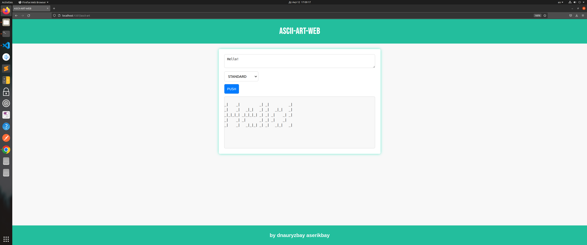
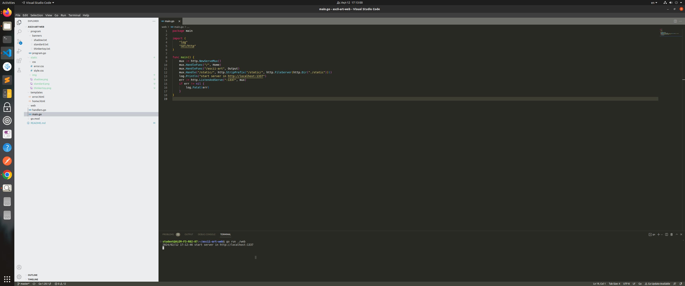

# **ASCII-ART-WEB**

A simple Go web-application to convert input text to ascii-art style.  
This web-application is able to read your text and convert it to each font mentioned below.

## Objectives

The possibilities of this project are to convert the input text into the following fonts:

- Standard
- Shadow
- Thinkertoy

### Here is some examples:

  




## Usage

1. Open the Terminal `CTRL + ALT + T`

2. Clone the repository:

    ```bash
    $ git clone https://github.com/suusslauaa/ascii-art-web.git
    ```

3. Open VSCode and VSCode terminal:

    ```bash
    $ code ascii-art-web/
    ```
    

4. There is a command to run this web-application:

    ```bash
    $ go run ./web
    ```

5. Open browser and follow this [link](http://localhost:4000)
## Author

- [suusslauaa](https://github.com/suusslauaa)